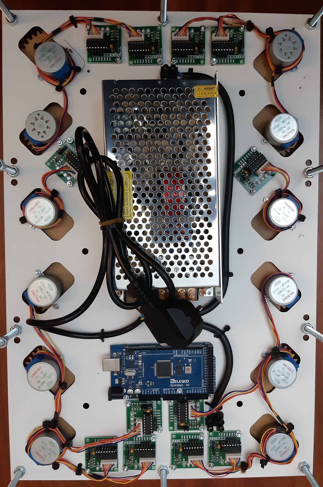
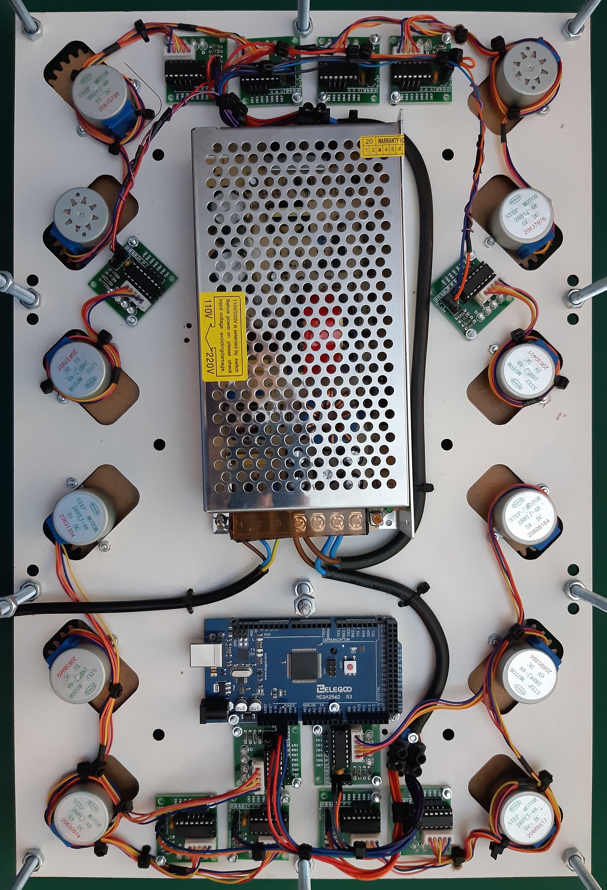

## Its clocks all the way down...

A digital clock made of 24 analog clocks.

Powered by an arduino, each clock handle is a stepper motor, totaling 48 steppers.

The clock body, gears and handles will be laser cut (3 or 5mm) MDF, the handle shafts (shaft?) will be made with solid 8mm and 10mm alu with 1mm wall. All pieces (but the gears) will be designed from scratch in corel draw.

For V1 ill make a simple, scaled down version using off the shelf gears.

V2 will be a full sized number (6 clocks, 12 motors). This will  already house the full size final power supply and the plan is to make it modular, so i can just add 3 more in the V3. Here ill need to implement some prettier control for the motors to move them in sync, and maybe some prettier transitions.

V3 will be a second iteraion with only number display, the backlash in the gearing was way to high, making it unusable.

~~V3~~ V4 will be the full sized 4 numbers display. This will most likely require me to use shift registers or other way to expand IO.

~~V4~~ V5 would be to make it double, or 4 times as big so i could play with the animations and different number designs. Most likely will never exist.

Also if you are reading this, please help me design a better number 8...

## V1

## V2

Fit test

Diagrams to laser cut

First laser cutting try

Motors and corresponding gears installed. Also power supply and some power cable routing

 

All driver boards installed, and motor cables routed.

 

The plan was to solder every power and data cable, but soldering iron is shit and makes it way too hard, while the new one doesnt come, ill settle for custom cable lenght. Seems tidy enough

All power cables done

At this point the soldering iron commited sudoku and melted itself, somwehow. So for now ill have this spaghetti bundle of data cables to match the code i'll write for it after. After fixing a bunch of faulty cables, everything seems to be working on both eletrical and mechanical side.

 

The only problem is related to the gears. At this point the clock handles have somewhere between 5 and 10 degrees of play, not even close to acceptable. I ended up drilling the mottor mounts by hand, which led to some clearance between the cogs, added to the 2:1 ratio that doubled the ammount of error. I will need another iteration before going for the full clock only to handle the mechanical part, Version 2.5.

### Coding

At this point i can start with the coding. The obvious problem is that moving a motor is a blocking function, so to move many motors simultaneously i will need to move all of them in tiny increments at a very fast pace. The AccelStepper library handles this already(to a degree), but i'm going to try an implementation from scracth. Ill compare it against AccelStepper later and see which fits better.

## V3

The code was kinda working, but i need better base to actually test it. Ill redo V2 with a new mid-plate, and try to sodder everything, instead of connecting. 
