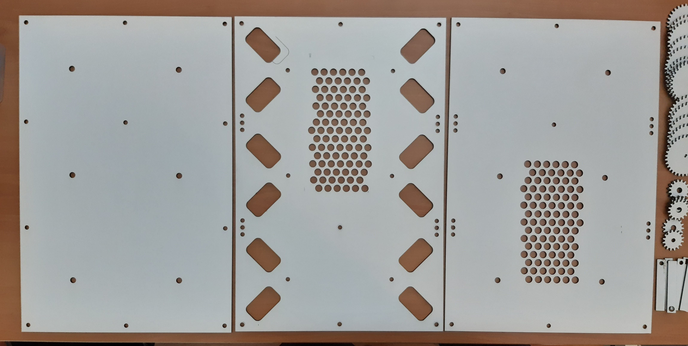
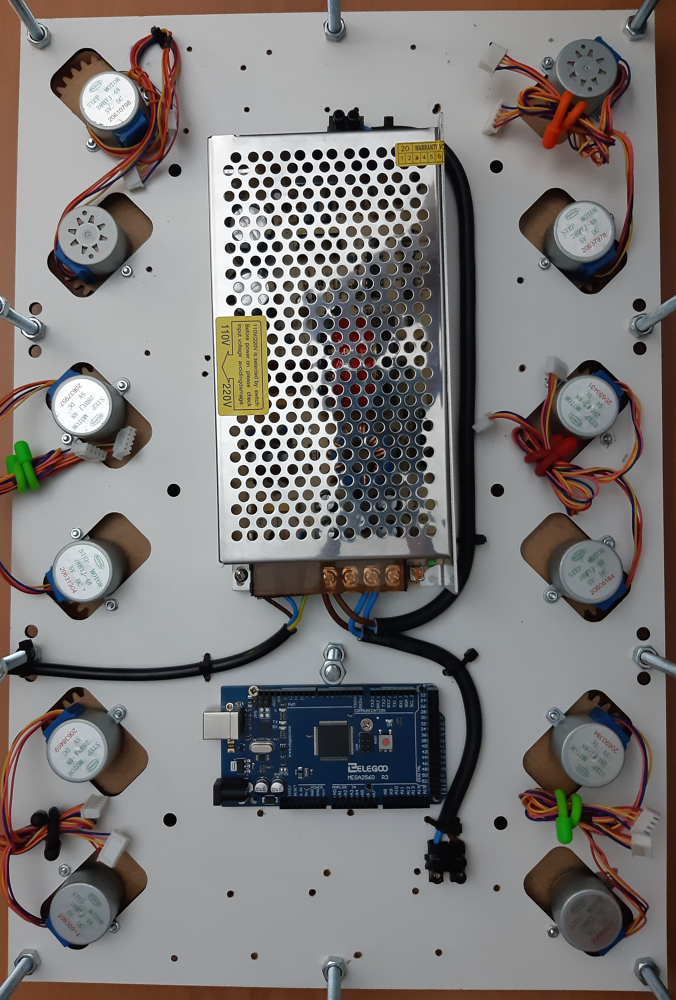

## Its clocks all the way down...

A digital clock made of 24 analog clocks.

Powered by an arduino, each clock handle is a stepper motor, totaling 48 steppers.

The clock body, gears and handles will be laser cut (3 or 5mm) MDF, the handle shafts (shaft?) will be made with solid 8mm and 10mm alu with 1mm wall. All pieces (but the gears) will be designed from scratch in corel draw.

For V1 ill make a simple, scaled down version using off the shelf gears.

V2 will be a full sized number (6 clocks, 12 motors). This will  already house the full size final power supply and the plan is to make it modular, so i can just add 3 more in the V3. Here ill need to implement some prettier control for the motors to move them in sync, and maybe some prettier transitions.

V3 will be the full sized 4 numbers display. This will most likely require me to use shift registers or other way to expand IO.

V4 would be to make it double, or 4 times as big so i could play with the animations and different number designs. Most likely will never exist.

Also if you are reading this, please help me design a better number 8...

 

## V1

 

## V2

Fit test

Diagrams to laser cut

First laser cutting try

Motors and corresponding gears installed. Also power supply and some power cable routing

 

