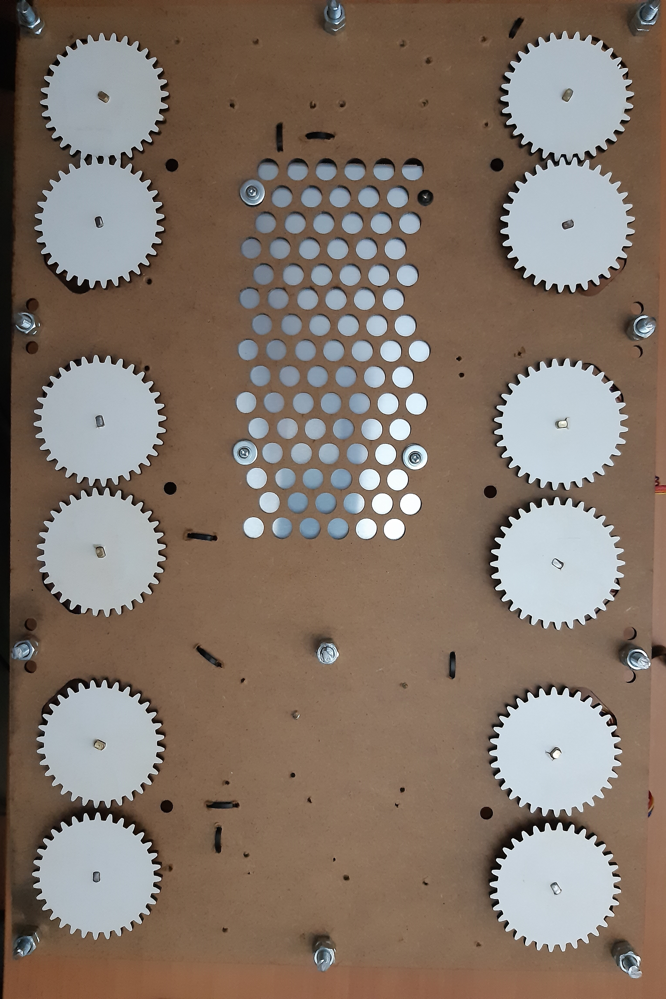

## Its clocks all the way down...

A digital clock made of 24 analog clocks.

Powered by an arduino, each clock handle is a stepper motor, totaling 48 steppers.

Why? because i'm part time masochist and like to having to do the same thing dozens of times 

[Click here for Video](https://www.youtube.com/watch?v=mT9d-I6LFRw)

~~The clock body, gears and handles will be laser cut (3 or 5mm) MDF, the handle shafts (shaft?) will be made with solid 8mm and 10mm alu with 1mm wall. All pieces (but the gears) will be designed from scratch in corel draw.~~

The clock "main body" will probably still be plywood/mdf. The body will now be only a front plate where the clock modules, psu, arduino and cables will atach (Maybe a back one for structure/tidiness). Later i can just do a thin pretty front cover and hide the screws. I will have to drill by hand though, the full clock wont fit the laser cutter.

The clock mechanism modules will now be fully 3d modeled printed, contaning ball bearings. Super gluing mdf to alu was already hard, keeping it all straight and square proved almost impossible and the end result was way too fragile. Modularity will allow me to swap/fix any clock without having to disassemble the whole thing. This will also probably help reducing slack and noise while increasing smootheness in the rotation

I'll also develop all the code (using some stepper libs) which will probably include some animations to make the transitions look nice, some kind of remote control, and maybe a small display for UI.

Also if you are still reading this, please help me design a better number 8.

## Version 1 
A simple, scaled down version using off the shelf gears. Only 1 clock for proof of concept

  
Click to see more!

## Version 2 
A full sized number (6 clocks, 12 motors). This will  already house the full size final power supply and the plan is to make it modular, so i can just add 3 more in the V3. Here ill need to implement some prettier control for the motors to move them in sync, and maybe some prettier transitions.

  
Click to see more!

Fit test

Diagrams to laser cut

First laser cutting try

Motors and corresponding gears installed. Also power supply and some power cable routing

 

All driver boards installed, and motor cables routed.

 

The plan was to solder every power and data cable, but soldering iron is shit and makes it way too hard, while the new one doesnt come, ill settle for custom cable lenght. Seems tidy enough

All power cables done

At this point the soldering iron tip commited sudoku and melted itself, somehow. So for now ill have this spaghetti bundle of data cables to match the code i'll write for it after. After fixing a bunch of faulty cables, everything seems to be working on both eletrical and mechanical side.

 

The only problem is related to the gears. At this point the clock handles have somewhere between 5 and 10 degrees of play, not even close to acceptable. I ended up drilling the mottor mounts by hand, which led to some clearance between the cogs, added to the 2:1 ratio that doubled the ammount of error. I will need another iteration before going for the full clock only to handle the mechanical part.

### Coding

At this point i can start with the coding. The obvious problem is that moving a motor is a blocking function, so to move many motors simultaneously i will need to move all of them in tiny increments at a very fast pace. The AccelStepper library handles this already(to a degree), but i'm going to try an implementation from scracth. Ill compare it against AccelStepper later and see which fits better.

## Version 3 
A second iteraion with only number display, the backlash in the gearing was way to high, making it unusable.

  
Click to see more!

The code was kinda working, but i need better base to actually test it. Ill redo V2 with a new mid-plate, and try to sodder everything, instead of connecting. 

Made some mockups to test the tolerance. Computer modeling can only take me so far, the laser cut, even though only 0.2mm ends up adding up to a big error

And a new midplate is born

 

I could make it cleaner, but its good enough

 

On the mechanical side of things, gears are now running way smoother and with a fraction on the backlash.

A bit of code and some clock dials and we got
[Click here for Video](https://www.youtube.com/watch?v=mT9d-I6LFRw)

Im pretty happy with the results, not sure ill go any further, the repetitiveness  of the project is a bit overwhelming

## Version 4 
(Current) has 2 major differences. Modular clock mechanisms, 3d modedeled and printed. On the eletronics side i will need to expand the IO using shif registers or anything else that works really; the previous iteration had every stepper connected directly, which works but limits me at aprox 15 steppers.

  
Click to see more!

  
  Prototyping
  
     
            
      
  

  And the final mechanical version

      
      

  The "final" version had some problems with slack. When using a bottom bearing to support both gears, meant the top one would have the combined play of both bearings. So i designed a finalfinal version, with a third bearing on top that couples to the lid, this way the gear assembly has almost zero lateral play.
  
     
          
     
  
  
  For the eletrical side of things, i pretty much given up on shift registers, so i'll most likely end up using one arduin for every digit, so 4 for the full clock.
  Comunication betwen arduinos seems easy, i might end up using a fifth arduino (a uno maybe) to calculate the positions of every dial, send them to the slaves and sync the start of movement.
  
  Since This time the plan is to actually build a clock and not a "digit", ill start by building the base board that will hold everything together. A 120x45cm board. Something like this
  
     
  

## Version N+1
This would be making it double, or 4 times as big so i could play with the animations and different number designs. Most likely will never exist.

## TO DO

  
Click to expand!

  
Shift Registers - Expand IO - Nope
  

Using the same cable for 1-2 pin on every motor can theoretically give me 50% less IO ports needed. This will most likely NOT work - Nope

Turning every motor on and off on every step can also theoretically make me only need the current that one motor uses, and make it possible to wire them all in the same  circuit only using like 500mA , but can lead to drift overtime, will need testing. - Probably nope

